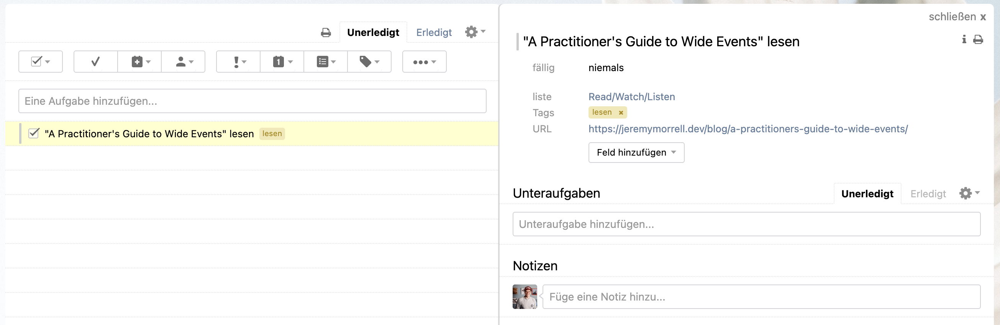
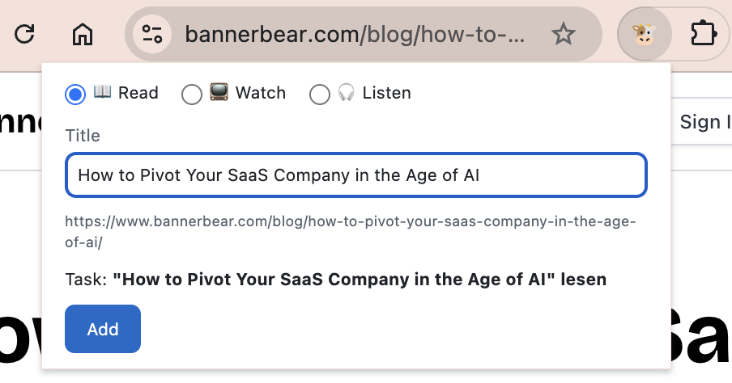
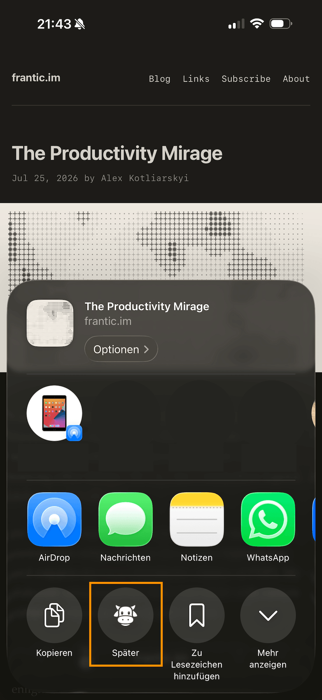

# 🐮 *Später*

Save articles, videos and podcasts you want to consume later as tasks in
[Remember The Milk](https://www.rememberthemilk.com/). With one click in Google Chrome
or from the Share functionality on your iPhone.

## What it does

You find an interesting link while browsing, or a friend sends one via WhatsApp, Signal
or Discord, but you don't have time or motivation to consume it right now. *Später*
sorts the link into one of three consumption categories, **Read** (articles), **Watch**
(videos) or **Listen** (podcasts), and turns it into a task in the Remember The Milk
list of your choice.

The link is stored as the task's URL, and the task has no due date:

*Example with the German preset: task name `"…" lesen`, tag `lesen`.*

*Später* comes in two flavours:

| Google Chrome extension | iPhone Share functionality |
|:-----------------------:|:--------------------------:|
|  |  |
| A button next to the address bar. Click it and the task will be created. | Share a link from Safari, YouTube, Spotify or any other app and pick *Später*. |
|  |  |

Task name and tag depend on the consumption category (examples with the English preset):

| Type   | Link                                                                    | Task name                                                         | Tag      |
|--------|-------------------------------------------------------------------------|-------------------------------------------------------------------|----------|
| Listen | `https://open.spotify.com/episode/6fNv8trMNhqtbhbOBWkLNS`               | `Listen to "How Linux is built with Greg Kroah-Hartman"`          | `listen` |
| Read   | `https://jeremymorrell.dev/blog/a-practitioners-guide-to-wide-events/`  | `Read "A Practitioner's Guide to Wide Events"`                    | `read`   |
| Watch  | `https://www.youtube.com/watch?v=u3GjIXP9N0s`                           | `Watch "AWS Distinguished Eng: Learning From 3000 Incidents …"`   | `watch`  |

## Documentation

- [FAQ: How links are classified](docs/link-classification.md)
- [Setup Prerequisite: Getting an RTM API key](docs/setup-rtm-api-key.md)
- [Setup: Google Chrome Extension](docs/setup-google-chrome-extension.md)
- [Setup: iPhone / iOS](docs/setup-iphone.md)
- [Architecture and data flow](docs/architecture.md)

All chapters: [docs/README.md](docs/README.md)

## Why *Später* and not "Remember The Milk Later"?

We wanted to call this project "Remember The Milk Later". Remember The Milk's
[branding guidelines](https://www.rememberthemilk.com/services/api/branding.rtm) don't
allow "Remember The Milk" or "RTM" in the name of a product built on their API, and they
don't allow their cow logo as an icon. We respect that, so the project is called
*Später* (German for "later"), and its icon is the cow emoji from Google's Noto Emoji.

## Attribution

This product uses the Remember The Milk API but is not endorsed or certified by
Remember The Milk.

## License

[MIT](LICENSE). The icons are rendered from [Noto Emoji](https://github.com/googlefonts/noto-emoji)
(Apache-2.0, see [`extension/icons/LICENSE`](extension/icons/LICENSE)). The MD5
implementation is [blueimp-md5](https://github.com/blueimp/JavaScript-MD5) (MIT).
