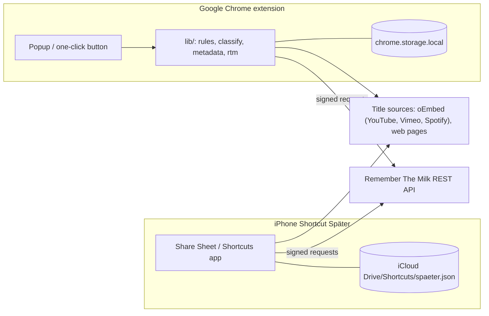
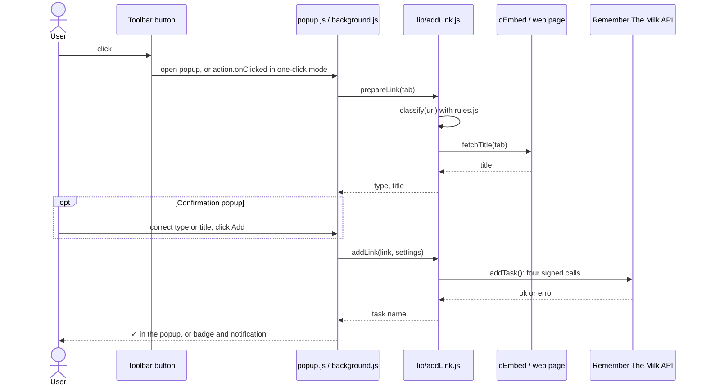
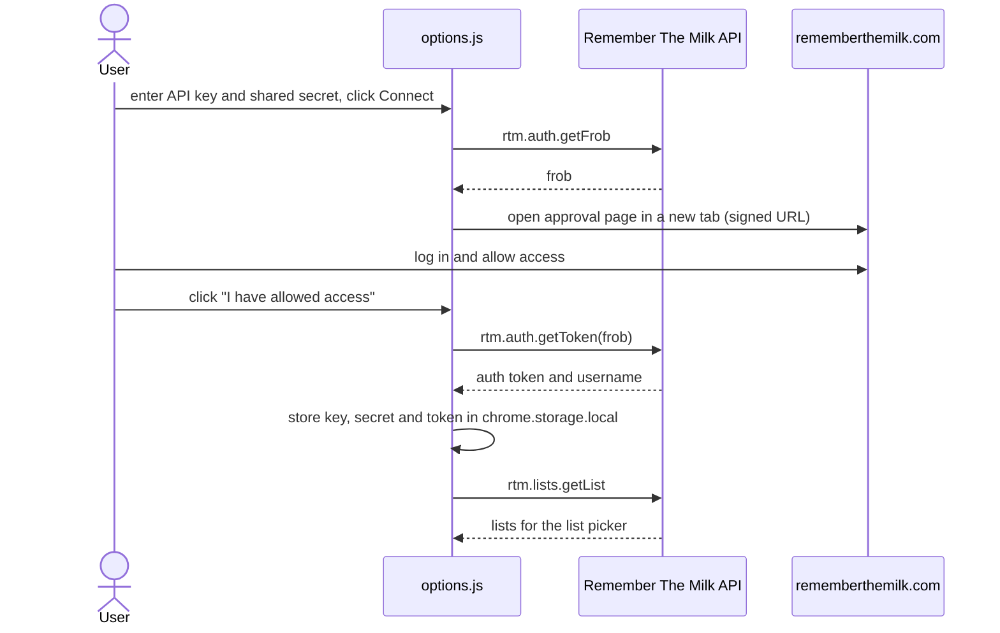
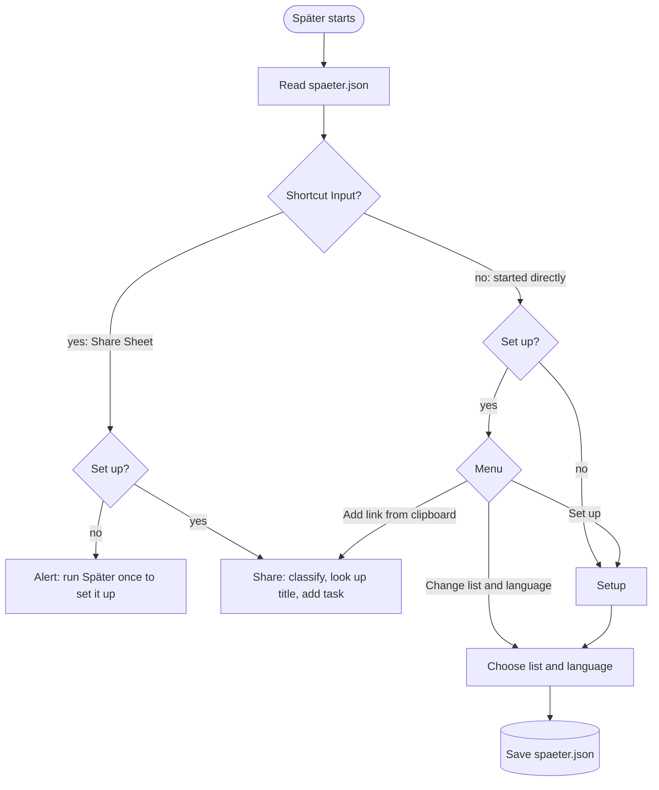
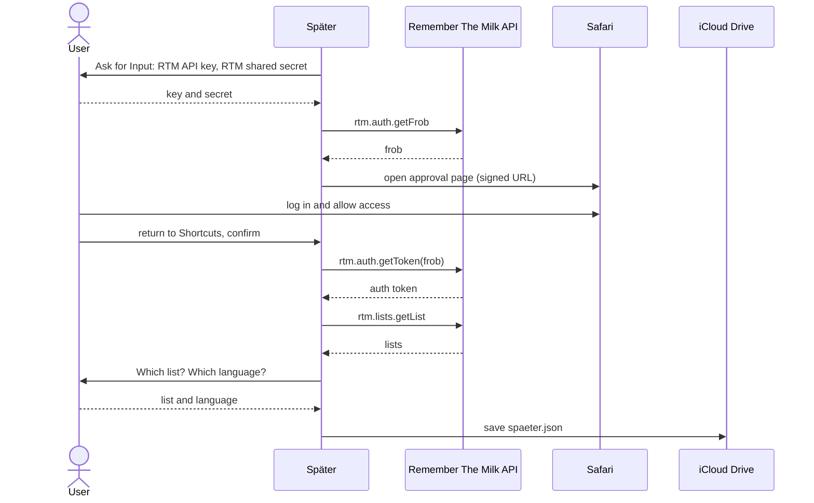
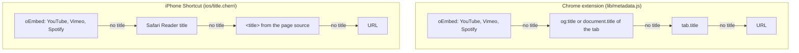
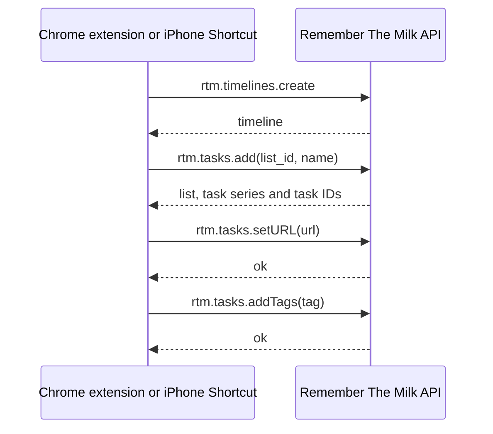
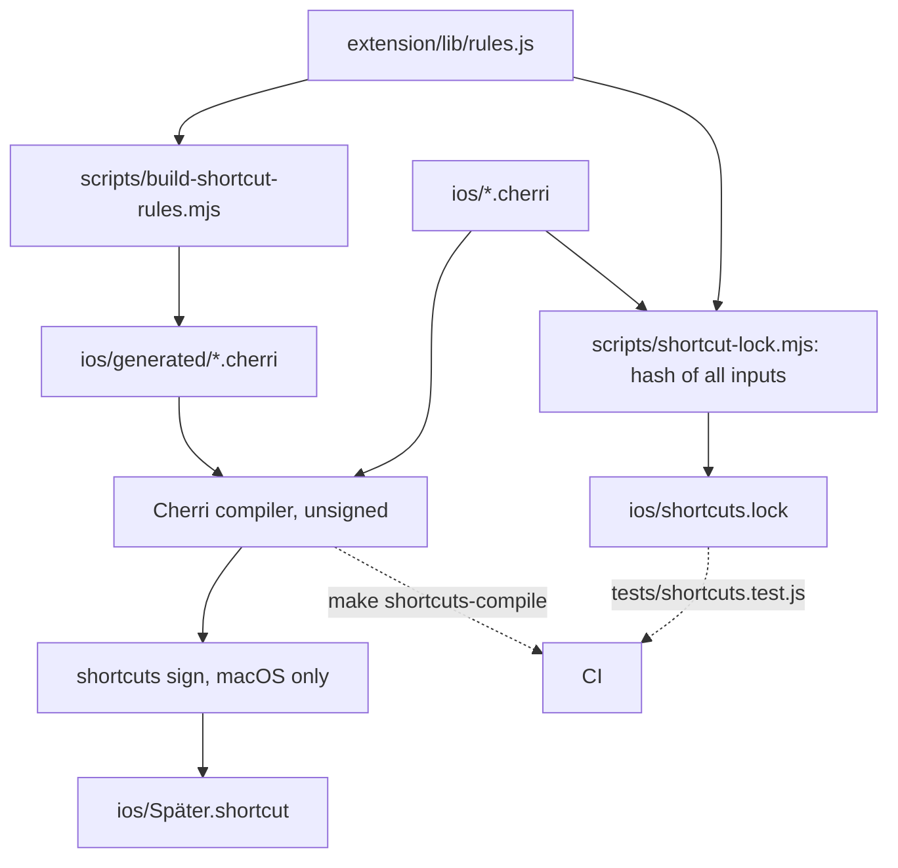

# Architecture and data flow

How the Chrome extension, the iPhone Shortcut and Remember The Milk work together. For
the code layout and development workflow, see [DEVELOPMENT.md](../DEVELOPMENT.md).

## System overview

Both clients talk to the Remember The Milk API directly; there is no server in between.
Each client stores its own credentials.

## Chrome: adding a link

With the confirmation popup turned on (default), the popup shows the detected type and
title for editing. With it turned off, the background worker adds the task right away.

## Chrome: connecting to Remember The Milk

The settings page uses RTM's desktop authentication flow, which needs no callback URL.

## iPhone: start modes

The same Shortcut behaves differently depending on how it is started. The setup never
runs from the Share Sheet: the login switches to Safari, which ends a Shortcut that runs
inside another app.

## iPhone: setup

## Title lookup

Each client tries its sources in order and stops at the first title it finds. Both fall
back to the URL, so a task never gets an empty name.

## Creating a task

Both clients create a task with the same four calls. Every request is signed with
`md5(shared secret + all parameters sorted by key)`. Smart Add is not used, so titles
are never turned into lists, tags or due dates.

## Building the iPhone Shortcut

The domains and task name presets come from the same file as in the Chrome extension.
Signing only works on a Mac, so CI compiles the Shortcut unsigned and the tests check
that the committed signed file was rebuilt.

Back to the [documentation overview](README.md).
